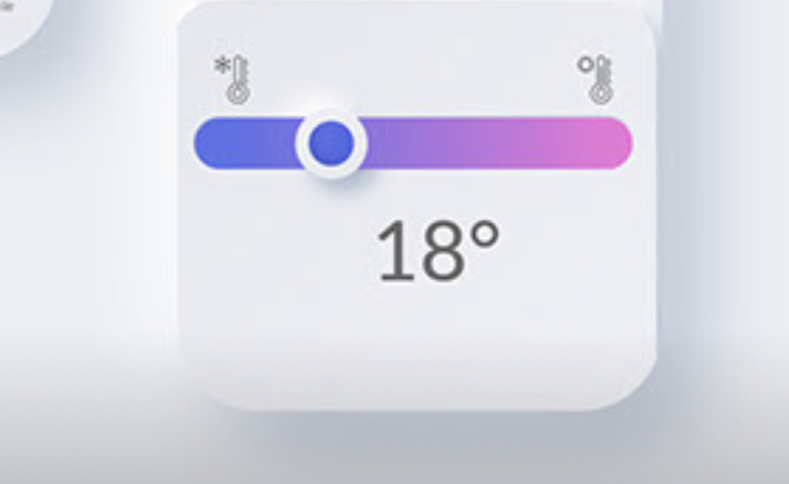

# Guild Presentation Demo

## Demystifying the journey from Widget to the RenderObject.

These are Dartpad links to the examples

**Widget** ・ [Gist](https://gist.github.com/jogboms/611fa584c0ed332bd7298e3d863b20ee) ・ [Dartpad](https://dartpad.dev/611fa584c0ed332bd7298e3d863b20ee)

**Multi-Child layout** ・ [Gist](https://gist.github.com/jogboms/1c969075f50b6155ff7b7aab9b1e171a) ・ [Dartpad](https://dartpad.dev/1c969075f50b6155ff7b7aab9b1e171a)

**CustomPainter** ・ [Gist](https://gist.github.com/jogboms/9a347da5ae1b6ae41d5d2075dfafa9b7) ・ [Dartpad](https://dartpad.dev/9a347da5ae1b6ae41d5d2075dfafa9b7)

**RenderObject** ・ [Gist](https://gist.github.com/jogboms/4b69fcd642e0179eb32dcd86dec87656) ・ [Dartpad](https://dartpad.dev/4b69fcd642e0179eb32dcd86dec87656)

---
[Dribbble Shot](https://www.behance.net/gallery/94673149/Smart-Home-Neumorphism-app-concept?tracking_source=curated_tools_xd)

